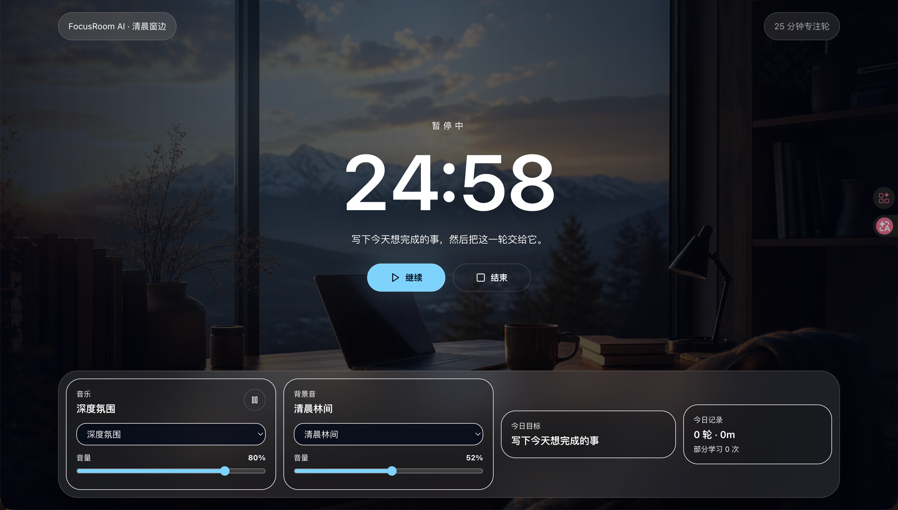
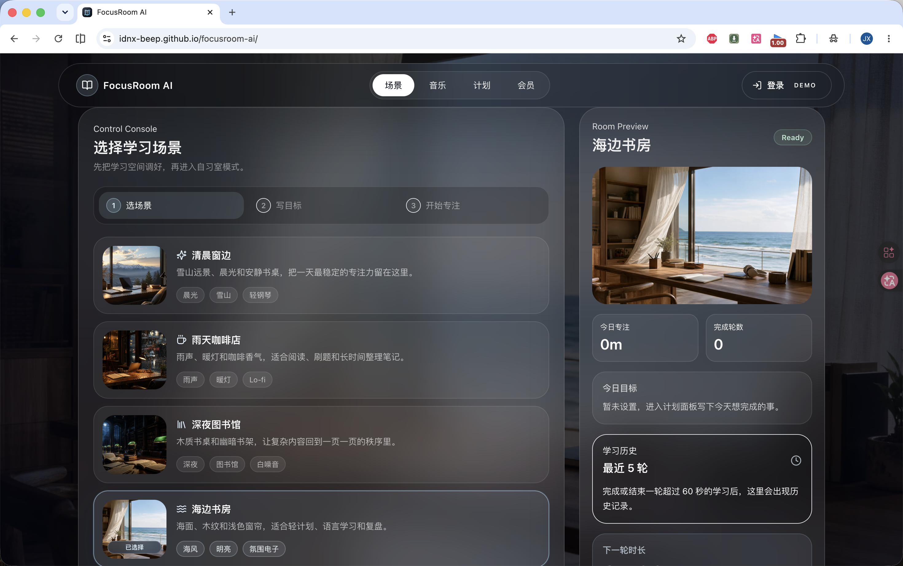

# FocusRoom AI

FocusRoom AI 是一个沉浸式 AI 自习室网页原型，面向 Study With Me、番茄钟专注和学习复盘场景。项目以电影感全屏场景、玻璃拟态控制台、本地声音合成和可恢复的专注 Session 为核心，帮助用户选择学习氛围、设定今日目标、进入自习室模式并记录每轮学习结果。

> 说明：当前项目名保留 FocusRoom AI，但尚未接入真实 AI API。现阶段的 AI 相关能力是基于本地规则生成的学习计划草稿；后续可接入 AI API，用于目标拆解、学习复盘总结和场景推荐。

## Screenshots

### 首页与场景氛围


### 专注自习室模式



### 场景与控制台



## Core Features

- 沉浸式场景选择：清晨窗边、雨天咖啡店、深夜图书馆、海边书房。
- 全屏电影感背景：WebP 场景图、暗色遮罩、淡入淡出过渡。
- 玻璃拟态 UI：顶部导航、控制台、HUD 控制条和弹窗保持统一视觉风格。
- 番茄钟专注流程：支持 25 / 45 / 50 / 90 分钟配置，并在 FocusMode 中避免误触修改时长。
- 专注 Session 持久化：刷新后可恢复正在进行或暂停中的专注轮。
- 学习统计：区分自然完成、手动结束和误点，完整轮数与实际学习时长分开记录。
- 本地声音系统：使用 Web Audio 生成音乐层、环境音、回声、混响和动态噪声，不依赖后端。
- 今日目标：目标输入保存在 localStorage，并生成本地规则版学习计划草稿。
- 学习结束复盘：完成一轮或手动结束超过 60 秒后记录「完成了什么 / 遇到什么问题 / 下一轮做什么」，保存为本地学习历史。
- 分享卡片：复盘后生成玻璃拟态学习复盘卡片，并支持复制分享文案。
- Demo 标识：登录和会员功能明确标记为 Demo / Coming soon，避免误解为真实账号或支付功能。
- 响应式布局：适配桌面和移动端基础使用场景。

## Tech Stack

- React 19
- Vite 6
- Tailwind CSS 3
- Lucide React Icons
- Web Audio API
- localStorage

## Product & Design Context

- [PRODUCT.md](PRODUCT.md)：产品定位、核心流程、已实现功能、边界和后续扩展方向。
- [DESIGN.md](DESIGN.md)：当前视觉语言、组件设计原则、移动端原则和后续 polish 注意事项。

## Getting Started

安装依赖：

```bash
npm install
```

启动开发服务：

```bash
npm run dev
```

构建生产版本：

```bash
npm run build
```

预览生产构建：

```bash
npm run preview
```

## Deployment

本项目适合部署到免费的 GitHub Pages。当前仓库使用 `gh-pages` 分支发布生产构建，源码保留在 `main` 分支。

部署流程：

1. 确认依赖已安装：`npm install`。
2. 执行 `npm run deploy`。
3. 脚本会先运行 `npm run build`，再通过 `gh-pages -d dist` 发布构建产物。
4. 在 GitHub 仓库中打开 `Settings -> Pages`。
5. Source 选择 `Deploy from a branch`。
6. Branch 选择 `gh-pages`，目录选择 `/ root`。

由于项目部署在 `https://idnx-beep.github.io/focusroom-ai/` 子路径下，`vite.config.js` 已设置 `base: "/focusroom-ai/"`，静态场景图也使用 `import.meta.env.BASE_URL` 生成路径。`dist/` 只作为发布产物生成和推送到 `gh-pages` 分支，不需要提交到 `main`。

## Project Structure

```text
focusroom-ai/
├── public/
│   └── scenes/              # WebP 场景图资源
├── docs/
│   └── screenshots/         # README 截图占位目录
├── src/
│   ├── components/          # 通用 UI 组件
│   ├── data/                # 场景、声音、localStorage key 等本地数据
│   ├── hooks/               # 音频、番茄钟、Session、统计、复盘等 hooks
│   ├── utils/               # 时间格式化、本地计划草稿生成
│   ├── views/               # ControlRoom 与 FocusMode 页面视图
│   ├── App.jsx              # 应用状态和主要流程接线
│   ├── main.jsx             # React 入口
│   └── styles.css           # Tailwind 与全局样式
├── package.json
├── vite.config.js
├── tailwind.config.js
└── postcss.config.js
```

## Current Status

已完成：

- 可运行的 React + Vite + Tailwind 前端项目。
- 场景选择、声音设置、番茄钟、今日目标、专注模式完整主流程。
- localStorage 保存目标、场景、番茄钟、声音设置、学习统计、专注 Session 和复盘历史。
- 刷新恢复专注状态，避免计时器误重置。
- 自然完成与手动结束分开统计，误点低于 60 秒不污染部分学习记录。
- 完成一轮或有效手动结束后的学习复盘输入、最近 5 条历史记录和分享卡片预览。
- 会员和登录功能已标记为 Demo / Coming soon。
- WebP 场景资源和基础 GitHub 上传配置。

尚未实现：

- 真实用户登录、云同步和会员系统。
- 真实 AI API 调用。
- 真实音频文件播放或版权音乐库接入。
- 完整历史复盘列表页和数据导出。

## Roadmap

- 接入 AI API：根据今日目标生成更细的学习步骤、复盘总结和下一轮建议。
- 增加学习历史页：按日期查看专注轮、学习时长和复盘内容。
- 增加真实音频素材：替换或混合 Web Audio 合成音，提高音质。
- 增加结束确认与中断原因：让部分学习统计更准确。
- 增强移动端 HUD：进一步压缩声音控制和统计模块。
- 增加更完整的可访问性验证：对比度审查、焦点顺序检查和屏幕阅读器流程走查。

## Notes

本项目是一个前端作品集原型，不包含后端服务，也不会向外部提交账号、目标或学习复盘数据。所有用户数据均保存在浏览器 localStorage 中。
